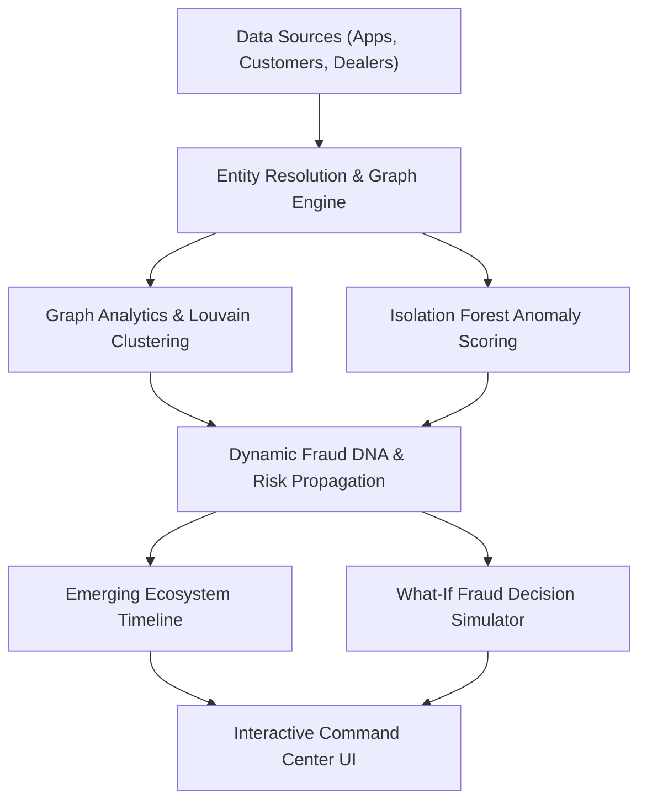

# 📊 TVS SENTINEL — Prototype Submission Presentation Deck

**AI-Powered Digital Twin for Predictive Fraud Ecosystems**  
*TVS Credit E.T.H.O.S. / Sentinel Hackathon — Problem Statement E*

---

## 📑 Slide Deck Overview

* **Slide 1:** Title & The Hook
* **Slide 2:** The Problem — The Blind Spot of Isolated Scoring
* **Slide 3:** The Solution — TVS Sentinel Digital Twin
* **Slide 4:** End-to-End System Architecture
* **Slide 5:** Core Innovation 1 — Dynamic 6D Fraud DNA
* **Slide 6:** Core Innovation 2 — Automatic Fraud Ring Discovery (Louvain)
* **Slide 7:** Core Innovation 3 — Emerging Fraud Ecosystem Prediction
* **Slide 8:** Core Innovation 4 — What-If Fraud Simulator & Decision Support
* **Slide 9:** Explainable AI & False-Positive Mitigation
* **Slide 10:** Live Working Prototype & Scale Metrics
* **Slide 11:** Business Value & ROI for TVS Credit
* **Slide 12:** Roadmap & Future Scalability
* **Slide 13:** Conclusion & Live Demo Transition

---

### **Slide 1: Title Slide & The Hook**

* **Title:** **TVS SENTINEL**
* **Subtitle:** AI-Powered Digital Twin for Predictive Fraud Ecosystems
* **Tagline:** *"Fraud doesn't happen in isolation. We detect the ecosystem behind it."*
* **Category:** Problem Statement E — Collective Intelligence & Hidden Relationship Discovery
* **Team:** Team Sentinel

> **🎨 Visual Recommendation:** High-tech dark theme background with a glowing network graph visual and TVS Sentinel branding.
>
> **🎤 Speaker Notes:**  
> *"Good morning judges. Traditional fraud detection evaluates loan applicants one by one. But organized lending fraud doesn't happen in isolation—it operates as an interconnected network of shared devices, rogue dealers, mule bank accounts, and synthetic guarantors. Introducing TVS Sentinel: an AI-driven living Digital Twin of the lending ecosystem that detects fraud rings, predicts how they form, and simulates future risk before fraud scales."*

---

### **Slide 2: The Problem — The Blind Spot of Isolated Scoring**

* **The Industry Reality:** NBFCs lose crores annually to organized lending syndicates.
* **The Fatal Flaw in Existing Systems:**
  * Application-level models evaluate applicants in isolation at a single point in time.
  * Legitimate-looking individual profiles pass standard bureau checks while secretly sharing underlying fraud infrastructure.
* **What Traditional AI Misses:**
  * Multi-application velocity bursts across synthetic identities.
  * Rogue dealer collusion hubs.
  * Shared hardware fingerprints and reused bank/guarantor networks.
* **The Paradigm Shift:** Moving from **Customer-Level Fraud Detection** ➔ **Ecosystem-Level Fraud Intelligence**.

> **🎨 Visual Recommendation:** Side-by-side comparison diagram:
> * *Left (Traditional):* Single isolated loan applicant with a "Green / Approved" tick.
> * *Right (Reality):* The same applicant connected to 10 other applications through a single hidden device and rogue dealer.
>
> **🎤 Speaker Notes:**  
> *"If 5 seemingly unrelated individuals apply for a Two-Wheeler or Used Car loan from different locations, an individual credit model will approve all five. But if all five share one hidden device fingerprint or one dealer collusion network, it is a ₹20 Lakh coordinated syndicate. Individual scoring is blind to this—we solve it through graph-based collective intelligence."*

---

### **Slide 3: The Solution — TVS Sentinel Digital Twin**

* **Living Digital Twin:** Connects **8 core lending entities** into a real-time relationship graph:
  1. **Loan Applications** (`APP`)
  2. **Customers** (`CUST`)
  3. **Device Fingerprints** (`DEV`)
  4. **Dealer Networks** (`DLR`)
  5. **Bank Accounts** (`BANK`)
  6. **Mobile Numbers** (`MOB`)
  7. **Locations** (`LOC`)
  8. **Guarantors** (`GUAR`)
* **Continuous Learning:** Dynamically mutates and updates as new applications enter the stream.
* **Three-Pillar Intelligence Paradigm:**
  1. **DETECT:** Automatic Fraud Ring & Collusion Discovery
  2. **PREDICT:** Emerging Fraud Ecosystems *while they are forming*
  3. **DECIDE:** Pre-decision "What-If" simulation before committing capital

> **🎨 Visual Recommendation:** Central living graph diagram showing bidirectional connections among the 8 entities.
>
> **🎤 Speaker Notes:**  
> *"TVS Sentinel creates a live digital twin of TVS Credit's entire lending operations. Every loan, phone, bank account, guarantor, dealer, and device forms a continuously evolving graph. When any new transaction enters, the system instantly evaluates not just 'Is this customer risky?', but 'Is this customer becoming part of a forming fraud ecosystem?'"*

---

### **Slide 4: End-to-End System Architecture**

* **Data & Entity Resolution:** Normalizes and maps 5,000+ applications across 18,000+ living nodes.
* **Graph Intelligence Layer:** NetworkX-powered relational graph maintaining 35,000+ active edges.
* **Machine Learning Ensemble:**
  * **Louvain Community Detection:** Unsupervised partitioning for multi-entity fraud rings.
  * **Isolation Forest Anomaly ML:** Multi-factor behavioral burst & density scoring.
  * **Probabilistic Risk Propagation:** Multi-hop network decay with false-positive safeguards.
* **Modern Web Delivery:** FastAPI backend + React/Vite interactive physics-based console.

> **🎤 Speaker Notes:**  
> *"Our architecture integrates multi-entity resolution with an advanced graph ML ensemble. We run Louvain community clustering to find coordinated syndicates, coupled with Isolation Forest to detect behavioral and velocity anomalies across the network."*

---

### **Slide 5: Core Innovation 1 — Dynamic 6D Fraud DNA**

* **Moving Beyond a Single Black-Box Number:**
  * Every application receives a dynamic 6-dimensional risk fingerprint:
    1. **Identity Risk** (Synthetic identity, profile mismatches)
    2. **Device Risk** (Hardware sharing, multi-identity switching)
    3. **Dealer Risk** (Hub concentration, dealer collusion index)
    4. **Location Risk** (Geographical clusters, unusual dispersion)
    5. **Behaviour Risk** (Application bursts, velocity anomalies)
    6. **Network Risk** (Proximity to known high-risk clusters)
* **Living Evolution:** DNA automatically recalibrates in real-time as adjacent nodes exhibit suspicious activity.

> **🎨 Visual Recommendation:** A sleek hexagonal Radar Chart showing the 6 dimensions + breakdown progress bars.
>
> **🎤 Speaker Notes:**  
> *"Instead of giving risk officers a single opaque number like '75% risk', TVS Sentinel generates a 6-Dimensional Fraud DNA. It pinpoints exactly where the threat originates—whether it's a compromised device, dealer collusion, or rapid behavioral velocity."*

---

### **Slide 6: Core Innovation 2 — Automatic Fraud Ring Discovery**

* **Unsupervised Cluster Detection:** Discovers hidden syndicates without needing pre-labeled fraud tags.
* **Multi-Entity Collusion Recognition:**
  * **Dealer-Driven Syndicates:** 1 rogue dealer processing loans across synthetic customer profiles.
  * **Mule Account Rings:** Multiple borrowers routing disbursements into shared bank accounts.
  * **Guarantor Loops:** Circular guarantees cross-backing defaulting applications.
* **Quantified Impact:** Identifies total nodes, entity breakdown, network risk, and **₹ Financial Exposure at Risk**.

> **🎨 Visual Recommendation:** Screenshot of the Fraud Ring Discovery screen with ring cards and subgraph inspector.
>
> **🎤 Speaker Notes:**  
> *"Using Louvain community detection, the system automatically discovered 40 distinct fraud rings across our dataset, quantifying over ₹45 Crores in exposure. Risk teams can inspect each ring's isolated topology and shared assets with a single click."*

---

### **Slide 7: Core Innovation 3 — Emerging Ecosystem Prediction**

* **Catching Fraud *While It Forms*, Not After Default:**
  * Traditional systems detect fraud 60–90 days post-disbursement (after consecutive EMI defaults).
  * TVS Sentinel detects network formation between **Day 1 and Day 12**.
* **The Pre-Fraud Growth Timeline:**
  * **Day 1:** 1 suspicious application submitted.
  * **Day 3:** 2 connected applications appear (shared device detected).
  * **Day 6:** Common guarantor linked.
  * **Day 8:** Same dealer routing applications.
  * **Day 12:** Full syndicate forms (Risk escalated: 21 ➔ 38 ➔ 57 ➔ 74 ➔ 94).
* **Business Benefit:** Intervene **5 to 10 days earlier**, preventing financial disbursement before loss occurs.

> **🎨 Visual Recommendation:** Step-by-step horizontal timeline displaying entity additions and risk escalation.
>
> **🎤 Speaker Notes:**  
> *"This is our primary innovation: Emerging Ecosystem Prediction. By analyzing structural growth velocity, we catch syndicates on Day 3 or Day 6 while the network is still forming, stopping payouts before the money ever leaves the bank."*

---

### **Slide 8: Core Innovation 4 — What-If Fraud Simulator**

* **Turning AI from a Detection Engine into a Decision-Support System:**
  * Allows credit underwriters and investigators to run pre-decision simulations.
* **Live What-If Analysis:**
  * *Input:* Select a pending loan application ➔ Choose **Approve**, **Hold**, or **Reject**.
  * *Simulation Output:*
    * **Projected Network Risk:** e.g., `67/100 ➔ 81/100` (High Danger Alert).
    * **New Network Connections:** Identifies newly created bridge edges across entities.
    * **Exposure Impact:** Calculates added portfolio exposure in ₹ Lakhs.
    * **Actionable Risk Warning:** Alerts underwriter if approval strengthens an emerging syndicate.

> **🎨 Visual Recommendation:** Before vs. After simulation card with delta indicators (+14 Risk, +4 Connections, Warning Badge).
>
> **🎤 Speaker Notes:**  
> *"The What-If Simulator bridges AI and human decision-making. Before approving a loan, an underwriter can simulate the decision to see if approving it would act as a bridge connecting two suspicious clusters. It empowers TVS Credit to stress-test decisions before committing capital."*

---

### **Slide 9: Explainable AI & False-Positive Mitigation**

* **Explainable AI (XAI) Evidence Ledger:**
  * Eliminates black-box decisions with weighted, auditable risk points:
    * `+25` Shared Device linked to 4 loan applications
    * `+20` Dealer associated with flagged syndicate #14
    * `+15` Bank account reused across unrelated PANs
* **False-Positive Safeguards (Section 8.1):**
  * **Coincidental Connection Down-Weighting:** High-frequency public Wi-Fi or showroom terminals are down-weighted to avoid falsely penalizing honest customers.
  * **Probabilistic Decay:** Multi-hop risk propagation decays exponentially across distance.
  * **Human-in-the-Loop Tiering:** Low-confidence alerts are marked for review—never auto-declined.

> **🎨 Visual Recommendation:** Evidence Breakdown card showing factor contributions and natural-language summary.
>
> **🎤 Speaker Notes:**  
> *"For regulated financial institutions, explainability is non-negotiable. Every alert provides an itemized evidence breakdown explaining exactly why the network was flagged. Furthermore, our false-positive safeguards prevent coincidental showroom connections from penalizing innocent customers."*

---

### **Slide 10: Live Working Prototype & Scale**

* **Full-Stack Working Prototype:**
  * **Command Center:** Real-time KPIs, live threat feed, and portfolio exposure breakdown.
  * **Network Explorer:** Interactive 18,000-node physics-based graph with entity filters and risk sliders.
  * **Ring Deep-Dive:** Subgraph isolation and shared asset matrix.
  * **What-If Console:** Real-time simulation engine.
* **Prototype Scale:**
  * **5,049** Loan Applications &nbsp;|&nbsp; **3,000** Customers &nbsp;|&nbsp; **40** Dealers
  * **18,095** Living Nodes &nbsp;|&nbsp; **35,158** Relationships &nbsp;|&nbsp; **40** Detected Fraud Rings

> **🎨 Visual Recommendation:** 4 high-resolution screenshot callouts showcasing the main UI screens.
>
> **🎤 Speaker Notes:**  
> *"This is not a mockup or wireframe. Everything you see is powered by a live, end-to-end working system with 18,095 nodes and 35,158 relationships executing live in real time."*

---

### **Slide 11: Business Value & ROI for TVS Credit**

| Metric | Traditional Approach | TVS Sentinel Platform | Business Value |
| :--- | :--- | :--- | :--- |
| **Detection Timing** | Post-disbursement default (60–90 days) | Pre-disbursement formation (Day 1–12) | **Direct loss prevention** |
| **Risk Scope** | Customer-level only | 8-entity collective intelligence | **Catches multi-borrower syndicates** |
| **Investigation Speed** | Manual multi-table audit (2–4 hours) | Visual 1-click graph isolation (< 10 sec) | **90% reduction in review time** |
| **Decision Support** | Static scorecard | Interactive What-If simulation | **Proactive portfolio protection** |

* **Estimated Financial Impact:** Saving **3%–5% of potential NBFC fraud losses** through early syndicate interception.

> **🎤 Speaker Notes:**  
> *"By shifting from reactive post-default recovery to pre-disbursement ecosystem prediction, TVS Sentinel can save 3% to 5% of fraud loss exposure while cutting investigator audit times from hours to seconds."*

---

### **Slide 12: Roadmap & Future Scalability**

* **Current Prototype (Phase 1 — Complete):**
  * Living Graph Twin, Louvain Community Clustering, Isolation Forest Anomaly Scoring, 6D Fraud DNA, Emerging Threat Timeline, What-If Simulator.
* **Production Roadmap (Phase 2):**
  * **Graph Neural Networks (GNNs):** GraphSAGE and Node2Vec embeddings for deep multi-hop pattern discovery.
  * **Distributed Graph Database:** Scaling to Neo4j / Amazon Neptune cluster for tens of millions of nodes.
  * **Real-Time Bureau & KYC Ingestion:** Streaming Kafka pipelines for sub-second edge creation.

---

### **Slide 13: Conclusion & Q&A**

* **Summary:**
  * **Detect:** Automatic discovery of hidden multi-entity fraud rings.
  * **Predict:** Early warning on emerging ecosystems before disbursement.
  * **Decide:** What-If simulation for confident, data-backed lending decisions.
* **Closing Statement:**  
  *"TVS Sentinel ensures that TVS Credit doesn't just detect fraudulent customers—we detect and predict the entire ecosystem behind them."*
* **Thank You!** Open for Questions & Live Demonstration.
